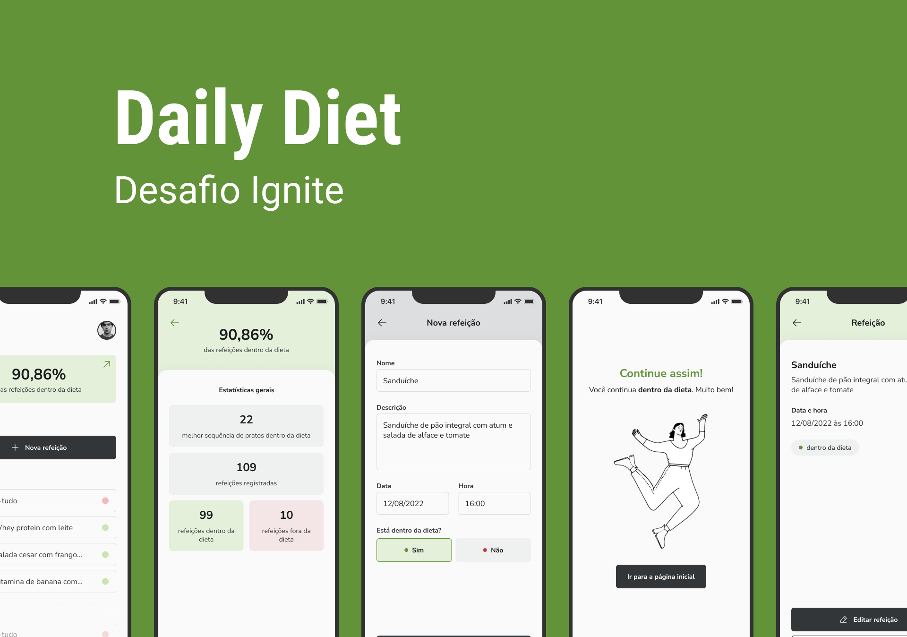
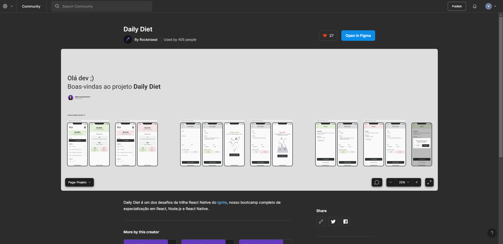

<h1 align="center">
   Daily Diet
</h1>

<p align="center">


</p>

---

<p align="center">
  <a href="#-projeto">Projeto</a>&nbsp;&nbsp;&nbsp;|&nbsp;&nbsp;&nbsp;
  <a href="#-como-rodar-o-projeto">Como rodar o projeto</a>&nbsp;&nbsp;&nbsp;|&nbsp;&nbsp;&nbsp;
  <a href="#-tecnologias">Tecnologias</a>&nbsp;&nbsp;&nbsp;|&nbsp;&nbsp;&nbsp;
  <a href="#-layout">Layout</a>&nbsp;&nbsp;&nbsp;|&nbsp;&nbsp;&nbsp;
  <a href="#-licença">Licença</a>
</p>

## 💻 Projeto

Nesse desafio, você vai desenvolver uma aplicação de cadastro de refeições, que contém as seguintes funcionalidades:

- [x] Adicionar uma nova refeição
- [x] Editar uma refeição
- [x] Remover uma refeição da listagem
- [ ] Mostrar as estatísticas do progresso da dieta
- [x] Navegação entre telas em pilha
- [x] Armazenamento local das refeições

Apesar de serem poucas funcionalidades, você vai precisar relembrar conceitos como:

- Estados
- Imutabilidade do estado
- Listas e chaves no React Native
- Propriedades
- Componentização
- Parâmetros de navegação

### 📱 Telas do aplicativo

## 🧭 Como rodar o projeto

### 🚨 Requisitos

**Instalação aplicativo do Expo no smartphone**

- [Expo Android](https://play.google.com/store/apps/details?id=host.exp.exponent&hl=pt_BR&gl=US) ou [Expo iOS](https://apps.apple.com/us/app/expo-go/id982107779)

**Clone este repositório**

**Acesse a pasta**

**Instale as dependências e inicie o projeto**

```bash
npm install
```

```bash
npx expo start
```

**Abra o projeto no dispositivo**

Abra o aplicativo do Expo no smartphone, aponte a câmera para o QRCode que apareceu no terminal após executar o comando `npx expo start`.

**Importante**: _O dispositivo móvel e o computador precisam estar na mesma rede_


## 🚀 Tecnologias

Esse projeto foi desenvolvido com as seguintes tecnologias:

- [Expo](https://expo.dev/)
- [TypeScript](https://www.typescriptlang.org/pt/)

## 🔖 Layout

Você pode visualizar o layout do projeto através [deste link](https://www.figma.com/community/file/1218573349379609244/Daily-Diet).

<a href="https://www.figma.com/community/file/1218573349379609244/Daily-Diet">
  
</a>

## 🗎 Notion

- [Link Notion](https://efficient-sloth-d85.notion.site/Desafio-02-Daily-Diet-98b7d85ec7e9428aa0f9f3bceed4380f)

## 📝 Licença

Esse projeto está sob a licença MIT. Veja o arquivo [LICENSE](LICENSE) para mais detalhes.
